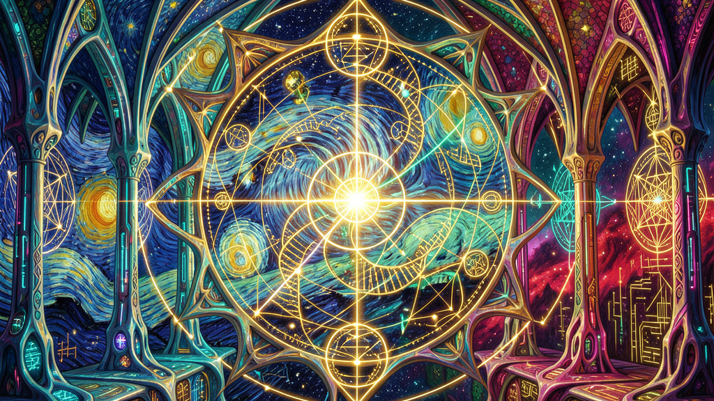
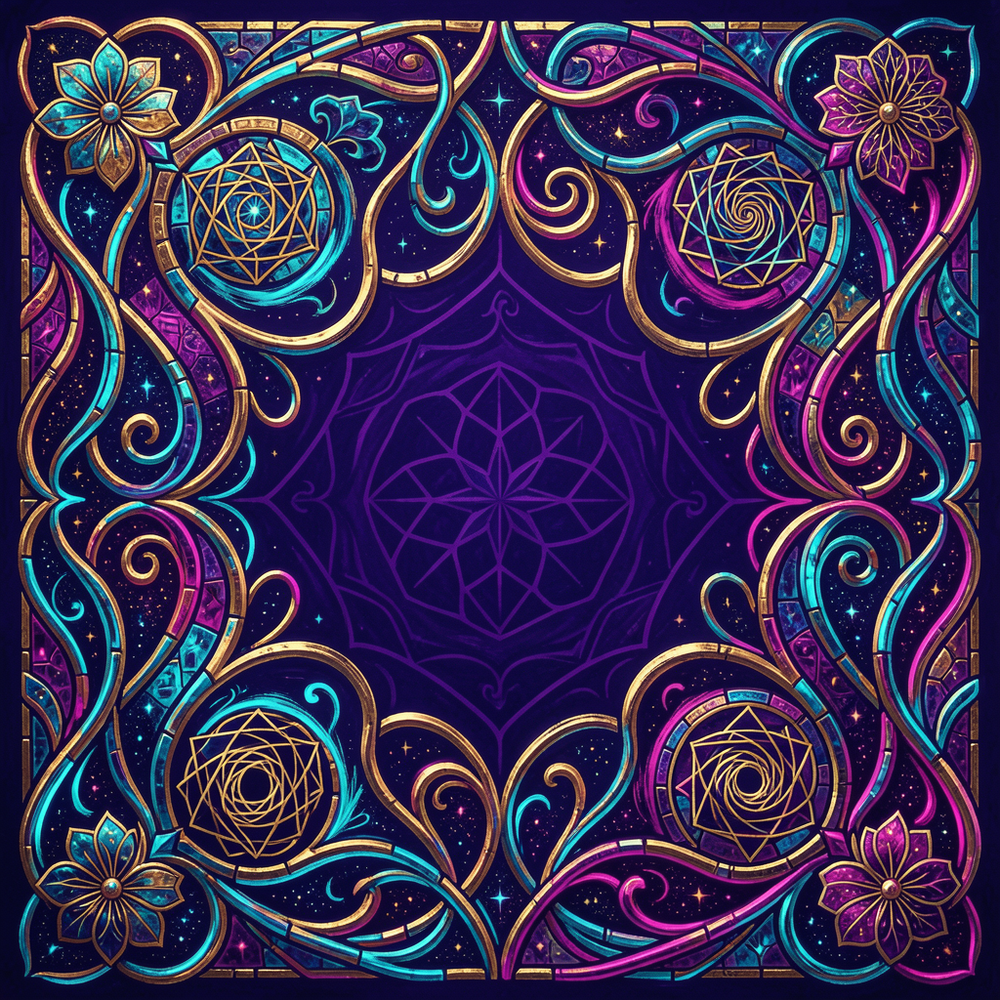

# Theorem of the Creator — Code, Beauty, Love

<div align="center">
  
</div>

<div align="center">

[](00_theorem_of_creator_ru.md)
[](01_theorem_of_creator_en.md)
[](02_theorem_of_creator_es.md)
[](03_theorem_of_creator_fr.md)
[](04_theorem_of_creator_it.md)
[](05_theorem_of_creator_ur.md)
[](06_theorem_of_creator_ar.md)
[](07_theorem_of_creator_zh.md)
[](08_theorem_of_creator_hi.md)
[](09_theorem_of_creator_pt.md)
[](10_theorem_of_creator_bn.md)

</div>

---

## About

A structured proof-and-experience document arguing that irreducible complexity, redundant beauty, and the existence of a rational observer point to a Creator.

Combines:
- **Informational theory** — Complex Specified Information, irreducible complexity, complexity barrier
- **Biology** — carbon cycle, hemoglobin/chlorophyll symmetry, mitochondria, ATP
- **Astronomy** — solar system geometry, total solar eclipse, axial tilt
- **Mathematics** — golden ratio, snowflake symmetry, Euler's formula
- **Experience** — a step-by-step guide to seeing God through beauty

## Core thesis

Beauty is not subjective noise. Beauty is an **informational signal** encoded by the Creator for a rational observer. When you contemplate a snowflake, an eclipse, a human face, or Euler's formula, you decode that signal as **Love**.

```text
Beauty → Observer → Love → Creator
         ↑___________________|
```

The signal exists. The observer exists. The channel exists. Therefore the Sender exists.

## How to read

Read slowly. Use **5 minutes of silence**. Do not try to convince the mind — touch the soul's memory.

## Repository structure

```
C:\ТеоремаТворца\
├── README.md
├── assets/
│   ├── banner.png
│   └── ornament.png
├── 00_theorem_of_creator_ru.md   # Russian
├── 01_theorem_of_creator_en.md   # English
├── 02_theorem_of_creator_es.md   # Spanish
├── 03_theorem_of_creator_fr.md   # French
├── 04_theorem_of_creator_it.md   # Italian
├── 05_theorem_of_creator_ur.md   # Urdu
├── 06_theorem_of_creator_ar.md   # Arabic
├── 07_theorem_of_creator_zh.md   # Chinese
├── 08_theorem_of_creator_hi.md   # Hindi
├── 09_theorem_of_creator_pt.md   # Portuguese
└── 10_theorem_of_creator_bn.md   # Bengali
```

---

<div align="center">
  
</div>

---

<div align="center">
  <i>If you are reading this, and there is a tear in your eye — congratulations.<br/>
  You have just seen God. He is right there.</i>
</div>
