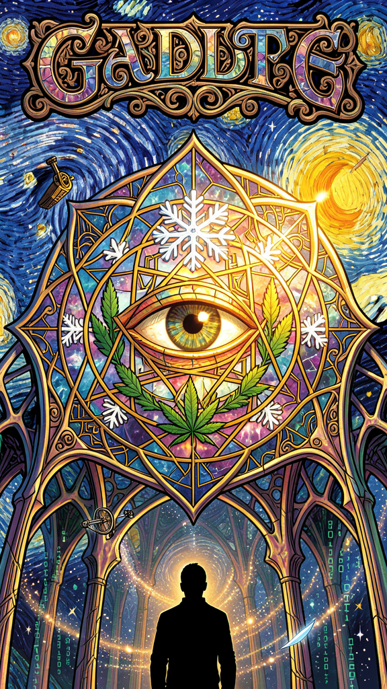

# Theorem of the Creator — Теорема Творца

**Multilingual repository for the Creator Theorem research project.**  
**Многоязычный репозиторий проекта Теорема Творца.**

---

## 🎨 Graphic Comic — Комикс

**20+ панелей** в уникальном стиле **«Киберпанк + Ван Гог + Гауди»** — комикс-адаптация всей истории от Действия 0 до Действия 10.

| Материал | Ссылка |
|----------|--------|
| 📖 Гайд по комиксу (все панели + описания) | [`COMIC_GUIDE.md`](COMIC_GUIDE.md) |
| 🖼️ Папка с иллюстрациями | [`assets/comic/`](assets/comic/) |

**Обложка:**



> Стиль: неон/схемы (**киберпанк**) + вращающееся звёздное небо/импасто (**Ван Гог**) + мозаика трэнкадис/органические арки (**Гауди**).

---

## 🌐 Language Selection / Выбор языка

| Language | Folder | Status | Files |
|----------|--------|--------|-------|
| 🇬🇧 **English (Default)** | [`en/`](en/) | ✅ Complete | Theorem, Core Story, Analytical Notes, Investor Prospectus, Full Compilation |
| 🇷🇺 **Русский** | [`ru/`](ru/) | ✅ Complete | Theorem, Core Story, Analytical Notes, Investor Prospectus, ICO Plan, Full Compilation + All 20 Cycles + Traces |
| 🇪🇸 **Español** | [`es/`](es/) | ✅ Theorem + Core Story | Theorem, Core Story |
| 🇫🇷 **Français** | [`fr/`](fr/) | ✅ Theorem + Core Story | Theorem, Core Story |
| 🇨🇳 **中文** | [`zh/`](zh/) | ✅ Theorem + Core Story | Theorem, Core Story |
| 🇯🇵 **日本語** | [`ja/`](ja/) | 🔄 Planned | — |
| 🇰🇷 **한국어** | [`ko/`](ko/) | 🔄 Planned | — |
| 🇩🇪 **Deutsch** | [`de/`](de/) | 🔄 Planned | — |
| 🇵🇹 **Português** | [`pt/`](pt/) | ✅ Theorem + Core Story | Theorem, Core Story |
| 🇮🇹 **Italiano** | [`it/`](it/) | ✅ Theorem + Core Story | Theorem, Core Story |
| 🇸🇦 **العربية** | [`ar/`](ar/) | ✅ Theorem + Core Story | Theorem, Core Story |
| 🇮🇳 **हिन्दी** | [`hi/`](hi/) | ✅ Theorem + Core Story | Theorem, Core Story |
| 🇺🇷 **اردو** | [`ur/`](ur/) | ✅ Theorem + Core Story | Theorem, Core Story |
| 🇧🇩 **বাংলা** | [`bn/`](bn/) | ✅ Theorem + Core Story | Theorem, Core Story |

---

## 📁 Repository Structure

```
ТеоремаТворца/
├── README.md                    # This file (entry point)
├── assets/                      # Shared images, diagrams
├── en/                          # English (DEFAULT)
│   ├── CREATOR_THEOREM_COMPLETE_COMPILATION.md
│   ├── 01_theorem_of_creator_en.md
│   ├── CORE_STORY_en.md
│   ├── ANALYTICAL_NOTE_EN.md
│   └── INVESTOR_PROSPECTUS_EN.md
├── ru/                          # Russian (most complete)
│   ├── CREATOR_THEOREM_COMPLETE_COMPILATION.md
│   ├── 00_theorem_of_creator_ru.md
│   ├── CORE_STORY_ru.md
│   ├── ANALYTICAL_NOTE_RU.md
│   ├── INVESTOR_PROSPECTUS_RU.md
│   ├── ICO_PLAN_EPIC_RU.md
│   └── CREATOR_TRACE_*.md       # All 20 cycles + additional traces
├── es/                          # Spanish
├── fr/                          # French
├── zh/                          # Chinese
├── ja/                          # Japanese (to translate)
├── ko/                          # Korean (to translate)
├── de/                          # German (to translate)
├── pt/                          # Portuguese
├── it/                          # Italian
├── ar/                          # Arabic
├── hi/                          # Hindi
├── ur/                          # Urdu
├── bn/                          # Bengali
└── ...
```

---

## 📚 Core Documents (All Languages)

| Document | Description |
|----------|-------------|
| **Theorem of the Creator** | Main theoretical synthesis — 20 cycles unified |
| **Core Story** | Narrative foundation: pedals, spear, helicopter, kittens |
| **Analytical Note** | Technical deep-dive on architecture |
| **Investor Prospectus** | Business/tokenomics for Silver Standard / NTC |
| **Full Compilation** | All cycles concatenated (300KB+) |

---

## 🧬 Russian Folder: Complete Research Cycles (20/20)

The `ru/` folder contains the complete research trace — **all 20 cycles** plus additional traces:

| Cycle | Topic | Key Insight |
|-------|-------|-------------|
| 1 | **Symmetry / Neuroform** | Symmetry = compression; symmetry breaking = information |
| 4 | **Mitochondria / Breath** | Proton gradient = battery; ROS = signal not noise |
| 6 | **Tetractys / Info Physics** | Landauer limit; Maxwell's Demon; Free Energy Principle |
| 9 | **Microbiome / Holobiont** | We are superorganisms; gut-brain axis = 3 channels |
| 10 | **Viral HGT / ERV** | 8% genome = viral; placenta = viral gene (syncytin) |
| 11 | **Eye Evolution** | 40+ independent origins; c-opsin vs r-opsin architectures |
| 12 | **Echolocation / Sonar** | Quantum biology navigation; Jamming avoidance = distributed consensus |
| 13 | **Cryptobiosis** | Tardigrades: pause/resume life at 0% water; trehalose glass |
| 14 | **Sleep / Dreams** | Offline training; glymphatic cleanup; lucid = meta-cognition |
| 15 | **Plasticity / Critical Periods** | Windows open/close; metaplasticity = plasticity of plasticity |
| 16 | **Epigenetics** | Environment writes to genome; epigenetic clocks; partial reprogramming |
| 17 | **Swarm Intelligence** | Stigmergy; quorum not consensus; no leader no architect |
| 18 | **Morphogenesis** | Turing patterns; positional info; regeneration = re-run embryogenesis |
| 19 | **Consciousness** | IIT (Φ), GWT (ignition), PP (active inference); AI consciousness tests |
| 20 | **Theorem of Creator** | **Synthesis: Reality = Information Field rendered by Observer via Verb of Creation** |

### Additional Traces (Russian)
- `CREATOR_TRACE_D1_D5_CELLULAR_MACHINERY.md`
- `CREATOR_TRACE_E1_E5_NEURO_CONSCIOUSNESS.md`
- `CREATOR_TRACE_G1_GENETIC_CODE.md`
- `CREATOR_TRACE_I1_I6_RENDERING_ANOMALIES.md` (Action Stories: pedals, spear, helicopter, kittens)
- `CREATOR_TRACE_K_BIOMIMICRY_CATALOG.md`
- `CREATOR_TRACE_Z1_Z7_MATHEMATICAL_SIGNATURES.md`
- `CREATOR_TRACE_ZH1_ZH5_PLANETARY_ENGINEERING.md`

---

## 🎯 Quick Start

**Default (English):**
```bash
cat en/CREATOR_THEOREM_COMPLETE_COMPILATION.md
```

**Russian (Most Complete):**
```bash
cat ru/CREATOR_THEOREM_COMPLETE_COMPILATION.md
```

**View All Languages:**
```bash
ls */
```

---

## 📦 Release Artifacts

| File | Description |
|------|-------------|
| `CREATOR_THEOREM_COMPLETE_COMPILATION.md` | **Single-file release** — all cycles + matrix + action stories + manifesto |
| `CREATOR_TRACE_*.md` | Individual cycle files (Russian) |
| `0*_theorem_of_creator_*.md` | Theorem in each language |
| `CORE_STORY_*.md` | Core narrative in each language |

---

## 🔗 Related Projects

- **PX Node** — Go implementation (35k LOC, 28 packages)
- **3 Flutter Apps** — Mobile interfaces
- **Python GTK Monitor** — Desktop observability
- **Docker / Silver Standard** — Physical Ag-backed SILVER on TON
- **NanoTaler Chain (NTC)** — CometBFT, 420 nodes, 420 NTL/tx

---

## 📝 License

Research documentation. Implementation code in separate repos.

---

*Last updated: 2026-07-27*  
*Generated by autonomous research cycles 1-20*